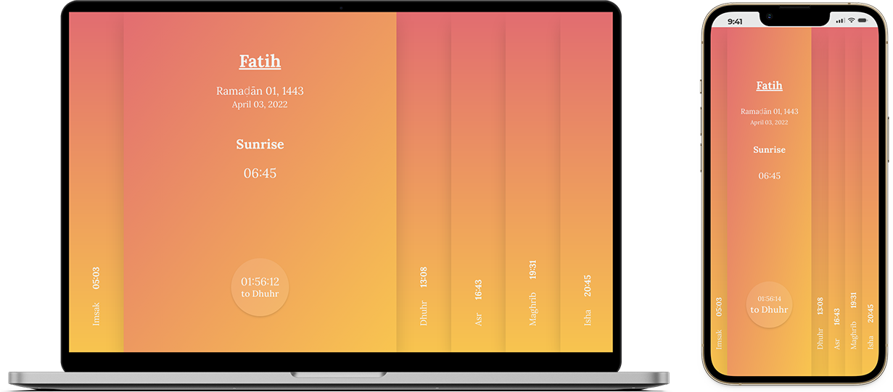

---

# pray times 🕌

this is a Muslim prayer time tracker progressive web application, uses Vue.js, [Al Adhan Prayer Times API](https://aladhan.com/prayer-times-api) and [Country State City API](https://countrystatecity.in/).

## running project

1. clone this repo, then

    ```bash
    cd pray-time
    npm install
    ```

2. after downloads and installation is done you should assign [Country State City API](https://countrystatecity.in/) key to related variable.

    ```console
    VUE_APP_COUNTRY_API_KEY=ADD_API_KEY
    ```

3. run project

   ```console
   npm run serve
   ```

## license


